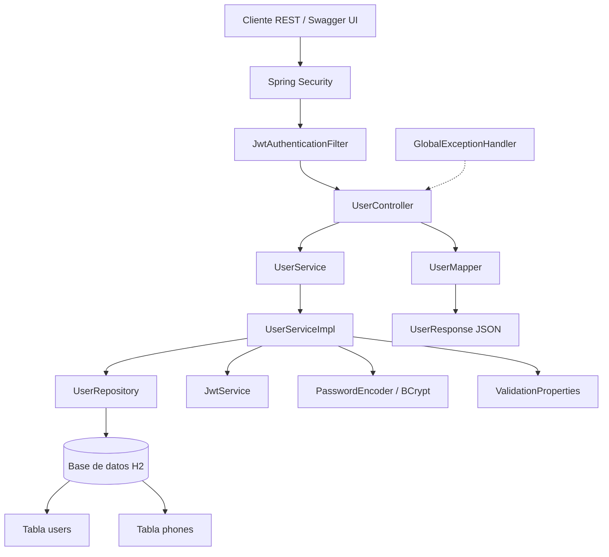

# Diagrama de arquitectura - Nisum User API

```mermaid
flowchart TD
    A["Cliente REST / Swagger UI"] --> B["Spring Security"]
    B --> C["JwtAuthenticationFilter"]
    C --> D["UserController"]
    D --> E["UserService"]
    E --> F["UserServiceImpl"]
    F --> G["UserRepository"]
    G --> H[("Base de datos H2")]

    F --> I["JwtService"]
    F --> J["PasswordEncoder / BCrypt"]
    F --> K["ValidationProperties"]

    H --> L["Tabla users"]
    H --> M["Tabla phones"]

    N["GlobalExceptionHandler"] -.-> D
    D --> O["UserMapper"]
    O --> P["UserResponse JSON"]
```